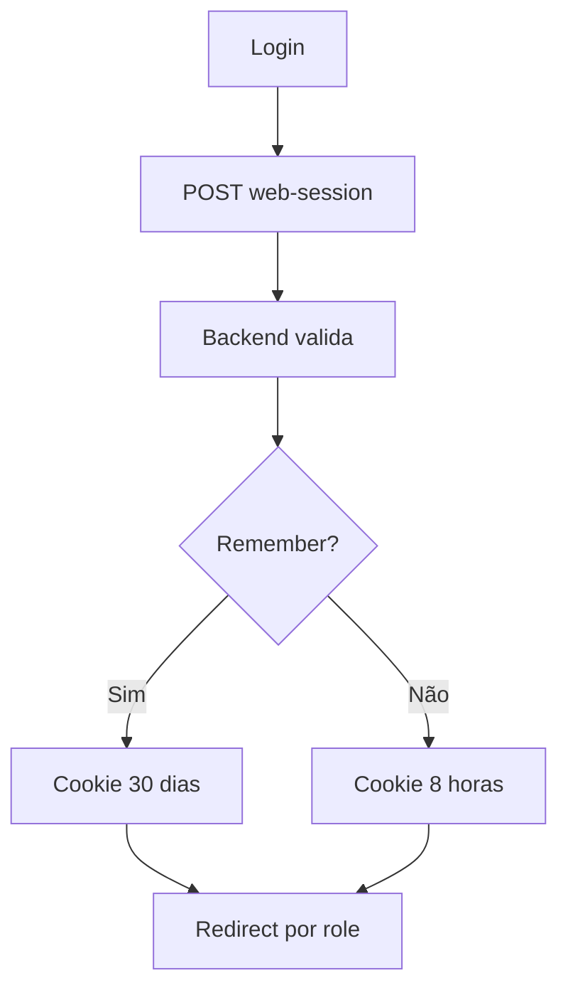
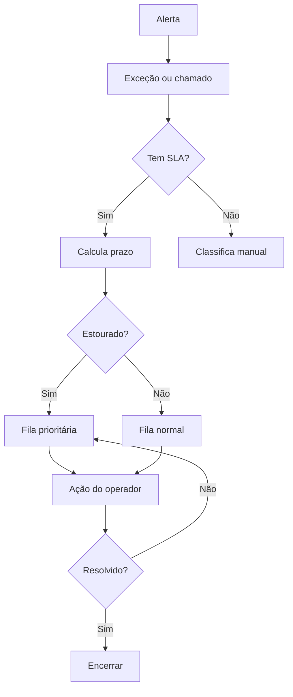

# Arquitetura — NOVA

## Stack

| Camada | Tecnologia |
|---|---|
| Frontend | Next.js 16 App Router |
| UI | React 19 |
| Linguagem | TypeScript strict |
| Backend | NestJS |
| ORM | Prisma |
| Banco | PostgreSQL |
| Monorepo | pnpm workspaces |
| CSS | `apps/web/app/nova-design-system.css` |
| Shell | `NovaLitShell` |

## Estrutura

```text
apps/
  web/
    app/
    components/
    lib/
  api/
    src/
    prisma/
docs/
```

## Frontend

Rotas em:

```text
apps/web/app
```

Componentes em:

```text
apps/web/components
```

Utilitários em:

```text
apps/web/lib
```

## Shell

Padrão:

```tsx
<NovaLitShell activeHref="/rota">
  ...
</NovaLitShell>
```

Não voltar a criar:

- `NAV_SECTIONS` por página;
- `function Nav()`;
- `function Topbar()`;
- shells duplicados.

## API server-side

Usar:

```ts
apiJson<T>("/rota")
```

Para painéis com fallback:

```ts
safeApiJson<T>("/rota", fallback)
```

## Banco

Banco local:

```text
nova_ops
```

Comandos:

```bash
pnpm --filter api exec prisma generate
pnpm --filter api exec prisma migrate status
```

## Fluxo de autenticação



## Fluxo operacional


