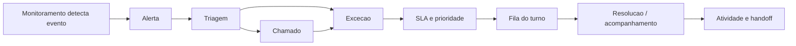
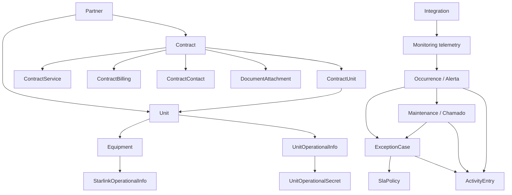

# Arquitetura funcional NOVA

Este documento complementa `docs/arquitetura-informacao-nova.md`. O foco aqui nao e apenas onde as paginas ficam, mas o que cada modulo precisa fazer para o site ficar correto, navegavel e funcional de ponta a ponta.

## Objetivo

Reconstruir o sistema NOVA por dominios funcionais, mantendo dados reais e compatibilidade temporaria, ate que cada pagina tenha:

- dono funcional claro;
- entidade de dados correta;
- API correspondente;
- acoes que realmente funcionam;
- breadcrumb e relacoes coerentes;
- estados de permissao, vazio, erro e carregamento;
- comparacao visual com o mockup quando houver mudanca de tela.

## Decisao tecnica principal

Nao vale reconstruir tudo de uma vez sem necessidade. O caminho correto e reconstruir por modulo, com criterio objetivo:

- Se a tela esta visualmente ruim, mas a entidade/API estao corretas: refatorar a tela.
- Se a tela parece correta, mas usa dados inventados ou inferidos: corrigir a entidade/API antes de evoluir a tela.
- Se o modulo mistura conceitos diferentes: redesenhar o modulo e manter redirects de compatibilidade.
- Se a rota existe apenas por historico tecnico: transformar em alias, nao em item de menu.

## Linguagem canonica

O backend pode manter nomes tecnicos, mas a UI deve falar a lingua do usuario.

| Conceito para usuario | Nome tecnico atual | Decisao |
| --- | --- | --- |
| Ativo | `Equipment` | UI usa "Ativo"; API pode continuar `/equipments` ate refactor posterior. |
| Alerta | `Occurrence` | UI usa "Alerta"; `/ocorrencias` vira compatibilidade. |
| Chamado | `Maintenance` | UI usa "Chamado"; `/manutencoes` vira compatibilidade. |
| Excecao | `ExceptionCase` | UI usa "Excecao"; fica em Operacao e tambem aparece na fila. |
| Unidade | `Unit` | Entidade principal de local. |
| Parceiro | `Partner` | Entidade dona das unidades e contratos. |
| Contrato | nao existe como entidade real | Precisa ser criado. Nao deve ser inferido de `Unit`. |
| Sensor/host | telemetria de integracao | Nao e cadastro principal; e leitura de monitoramento. |

## Dominios funcionais

### 1. Identidade e acesso

Responsavel por login, sessao, usuarios, perfis e permissao.

Rotas:

- `/login`
- `/usuarios`
- `/perfis`

APIs:

- `/auth/login`
- `/auth/session`
- `/users`

Regras:

- Admin cria e edita usuarios.
- Editor opera dados sem administrar acesso.
- Viewer consulta sem alterar dados sensiveis.
- Todo reveal de segredo precisa exigir admin e deixar trilha de auditoria.

### 2. Cadastros operacionais

Responsavel pelas entidades permanentes:

```text
Parceiro -> Unidade -> Ativo
```

Rotas canonicas:

- `/parceiros`
- `/parceiros/[id]`
- `/unidades`
- `/unidades/[id]`
- `/ativos`
- `/ativos/[id]`

Funcoes obrigatorias:

- listar, filtrar e paginar;
- criar;
- editar;
- ativar/inativar;
- ver relacionados;
- abrir historico operacional;
- anexar documentos quando fizer sentido;
- exportar quando houver necessidade operacional.

O que nao deve ficar aqui:

- fila de turno;
- SLA operacional;
- importacao em massa;
- configuracao de integracao;
- relatorio exportavel.

### 3. Contratos

Responsavel por condicoes comerciais e documentais que cobrem unidades.

Entidades-alvo:

```text
Contract
ContractUnit
ContractService
ContractBilling
ContractContact
DocumentAttachment(entityType="contract")
```

Rotas canonicas:

- `/contratos`
- `/contratos/cadastro`
- `/contratos/[id]`
- `/contratos/[id]/editar`

APIs-alvo:

- `GET /contracts`
- `POST /contracts`
- `GET /contracts/:id`
- `PATCH /contracts/:id`
- `POST /contracts/:id/units`
- `DELETE /contracts/:id/units/:unitId`
- `POST /contracts/:id/services`
- `PATCH /contracts/:id/billing`
- anexos via `contract/:id/attachments`

Regras:

- Contrato pertence a um parceiro.
- Contrato cobre uma ou mais unidades.
- Unidade pode ter mais de um contrato ao longo do tempo, mas apenas contratos ativos devem aparecer como vigentes.
- Banda contratada deve estar no contrato ou no vinculo contrato-unidade, nao solta na unidade como fonte principal.
- Documento contratual e anexo de contrato, nao anexo generico de unidade.
- Enquanto `Contract` nao existir, `/contratos` deve indicar claramente que a leitura e inferida por unidade.

### 4. Monitoramento

Responsavel por saude tecnica e telemetria.

Rotas canonicas:

- `/monitoramento`
- `/monitoramento/sensores`
- `/monitoramento/mapas`
- `/monitoramento/fontes`

APIs atuais:

- `/monitoring/summary`
- `/monitoring/command-center`
- `/monitoring/unit-hosts`
- `/monitoring/reports/sources`
- `/monitoring/reports/groups/zabbix`

Regras:

- Monitoramento mostra estado, nao cria chamado automaticamente sem fluxo explicito.
- Sensores/hosts podem apontar para unidade e ativo.
- Alertas derivados de monitoramento entram em Operacao.
- Relatorios gerados a partir de monitoramento ficam em Relatorios, nao nesta area.

### 5. Operacao

Responsavel pelo trabalho do turno.

Rotas canonicas:

- `/operacao`
- `/operacao/fila`
- `/alertas`
- `/alertas/[id]`
- `/chamados`
- `/chamados/[id]`
- `/excecoes`
- `/excecoes/[id]`
- `/operacao/atividade`

Fluxo funcional principal:



Regras:

- Alerta e fato observado.
- Chamado e trabalho planejado/executado.
- Excecao e caso operacional priorizado.
- Fila e modo de trabalho, nao entidade separada.
- Toda transicao relevante gera `ActivityEntry`.
- SLA deve ser aplicado a excecao e refletido na fila.

### 6. Relatorios

Responsavel por documentos e analises exportaveis.

Rotas canonicas:

- `/relatorios`
- `/relatorios/monitoramento`
- `/relatorios/consumo`
- `/relatorios/disponibilidade`
- `/relatorios/performance`
- `/relatorios/exportacoes`

APIs atuais:

- `/monitoring/report-templates`
- `/monitoring/report-template-runs`
- `/monitoring/reports/export`
- `/monitoring/reports/export-jobs`

Regras:

- Relatorio nao e dashboard operacional.
- Tela de relatorio deve deixar claro: filtro, pre-visualizacao, exportacao e historico.
- Templates pertencem a Relatorios, mesmo quando usam dados de Monitoramento.

### 7. Administracao e governanca

Responsavel por configuracao, integracoes, automacoes, importacao e reconciliacao.

Rotas canonicas:

- `/administracao/importacao`
- `/administracao/reconciliacao`
- `/administracao/automacoes`
- `/administracao/sla`
- `/integracoes`
- `/configuracoes`

Regras:

- Importacao e reconciliacao nao devem aparecer como rotina do turno.
- Automacao e configuracao de comportamento do sistema.
- SLA tem dois modos: configuracao em Administracao, leitura operacional na Fila/Excecoes.
- Integracoes controlam origem de dados, credenciais e sincronizacao.

## Contrato funcional de paginas

### Toda pagina de lista precisa ter

- titulo e subtitulo orientados a tarefa;
- filtros principais;
- busca;
- paginacao ou limite claro;
- estado vazio real;
- estado de erro;
- contagem total;
- acao principal coerente;
- links para detalhe;
- sem dados mockados quando existir API;
- permissao visual consistente com o papel do usuario.

### Toda pagina de detalhe precisa ter

- breadcrumb canonico;
- resumo da entidade;
- status atual;
- acoes permitidas;
- entidades relacionadas;
- historico/atividade quando existir;
- documentos/anexos quando fizer sentido;
- link de volta para lista;
- nenhuma acao "fake".

### Toda pagina de criacao/edicao precisa ter

- campos iguais aos que a API aceita;
- validacao server-side;
- erro visivel quando falhar;
- redirecionamento para a entidade criada/editada;
- revalidacao das listas relacionadas;
- protecao por permissao.

### Todo dashboard precisa ter

- cards que respondem a perguntas reais;
- links para a lista que explica o numero;
- periodo ou escopo explicito;
- sem duplicar CRUD que pertence a outro modulo.

## Modelo funcional alvo



## Rotas canonicas e aliases

| Canonica | Aliases temporarios | Acao |
| --- | --- | --- |
| `/ativos` | `/equipamentos` | manter redirect; menu mostra apenas Ativos. |
| `/ativos/[id]` | `/equipamentos/[id]` | mover implementacao real para `/ativos/[id]` em fase propria. |
| `/alertas` | `/ocorrencias` | manter redirect; menu mostra apenas Alertas. |
| `/chamados` | `/manutencoes` | manter redirect; menu mostra apenas Chamados. |
| `/excecoes` | `/operacao/excecoes` | manter redirect; menu mostra Excecoes em Operacao. |
| `/administracao/automacoes` | `/automacao`, `/operacao/automacoes` | criar rota canonica e manter aliases. |
| `/administracao/importacao` | `/importacao`, `/operacao/importacao` | criar rota canonica e manter aliases. |
| `/administracao/reconciliacao` | `/reconciliacao`, `/reconciliacao-central` | criar rota canonica e manter aliases. |

## Criterios de aceite 100%

Uma pagina so fica pronta quando passar por todos os pontos abaixo:

1. `lint` passa.
2. `build` passa.
3. APIs chamadas pela pagina retornam dados reais.
4. CRUD principal funciona quando a pagina promete CRUD.
5. Permissoes bloqueiam acoes indevidas.
6. Links principais levam para rotas existentes.
7. Estado vazio nao quebra layout.
8. Estado de erro e compreensivel.
9. Mobile nao sobrepoe texto nem controles.
10. Screenshot desktop comparado com mockup quando for pagina visual.
11. Screenshot mobile quando houver mudanca estrutural.
12. Nenhum botao sem acao real.
13. Nenhum numero importante sem origem rastreavel.
14. Breadcrumb segue a hierarquia canonica.
15. Rotas antigas redirecionam sem aparecer como conceito novo.

## Matriz minima de testes funcionais

| Modulo | Prova funcional minima |
| --- | --- |
| Login e sessao | Login valido entra; login invalido mostra erro; logout encerra sessao. |
| Usuarios/perfis | Admin cria, edita, troca senha e bloqueia acesso indevido. |
| Parceiros | Criar parceiro, editar, listar unidades vinculadas e contatos. |
| Unidades | Criar unidade, vincular parceiro, editar monitoramento, abrir ativos e dados operacionais. |
| Ativos | Criar ativo, vincular unidade, filtrar por tipo, abrir detalhe e dados especificos. |
| Contratos | Criar contrato, vincular unidades, anexar documento, editar servicos/SLA/faturamento. |
| Monitoramento | Ler telemetria real, filtrar sensores, abrir unidade/ativo a partir do host. |
| Alertas | Criar/editar alerta, abrir detalhe, gerar chamado e/ou excecao relacionada. |
| Chamados | Criar/editar chamado, vincular alerta, unidade e ativo, atualizar status. |
| Excecoes | Criar excecao, atribuir, comentar, silenciar/reconhecer/resolver e refletir na fila. |
| Fila | Mostrar prioridade correta, filtros por estado, bulk update e SLA vencido. |
| Relatorios | Criar template, previsualizar dados, exportar e consultar historico. |
| Integracoes | Criar conector, testar conexao, sincronizar hosts e registrar falhas. |
| Importacao/reconciliacao | Preview antes de importar, executar importacao, reconciliar entidades sem duplicar. |

## Plano de reconstrucao

### Fase 0 - Base de controle

Objetivo: parar de aumentar a bagunca.

- Congelar este blueprint como referencia.
- Definir `NovaLitShell` como shell unico.
- Manter `AppShell` apenas enquanto houver pagina antiga, sem novos usos.
- Criar checklist de pagina pronta.
- Nao criar modulo visual novo sem entidade/API definida.

### Fase 1 - Navegacao canonica

Objetivo: o usuario entender onde esta.

- Atualizar `MENU_SECTIONS`.
- Ajustar breadcrumbs das paginas principais.
- Tirar aliases do menu.
- Corrigir `/relatorios` ativo como `/relatorios`.
- Organizar Monitoramento, Operacao, Cadastros, Contratos, Relatorios e Administracao.

### Fase 2 - Cadastros fundamentais

Objetivo: deixar correta a base `Parceiro -> Unidade -> Ativo`.

- Revisar `/parceiros`, `/unidades`, `/ativos`.
- Garantir detalhes consistentes.
- Centralizar links relacionados.
- Remover linguagem conflitante entre ativo/equipamento.
- Validar criar, editar, inativar e navegar.

### Fase 3 - Contratos reais

Objetivo: parar de inferir contrato por unidade.

- Criar modelos Prisma de contratos.
- Criar migrations.
- Criar service/controller de contratos.
- Criar importacao/backfill a partir de `reportContractLabel`.
- Transformar `/contratos` em carteira real.
- Criar `/contratos/[id]` real.
- Vincular documentos, unidades e servicos.

### Fase 4 - Operacao ponta a ponta

Objetivo: triagem funcionar como trabalho real.

- Validar alerta -> chamado.
- Validar alerta/chamado -> excecao.
- Validar excecao -> SLA -> fila.
- Validar atividade/handoff.
- Corrigir CTAs e estados em detalhes.
- Garantir que nenhuma acao operacional seja decorativa.

### Fase 5 - Monitoramento e relatorios

Objetivo: separar leitura tecnica de documento exportavel.

- Reorganizar sensores e mapas sob Monitoramento.
- Manter alertas sob Operacao.
- Consolidar templates e historico sob Relatorios.
- Garantir exportacao real e historico rastreavel.

### Fase 6 - Administracao e dados legados

Objetivo: governanca sem misturar com rotina operacional.

- Mover importacao/reconciliacao para Administracao.
- Consolidar integracoes.
- Garantir reveal de credenciais com permissao e auditoria.
- Validar legado de contatos, parceiros e Starlinks.

### Fase 7 - Paridade visual por mockup

Objetivo: depois da funcao correta, alinhar visual sem quebrar regra de dominio.

- Para cada pagina alterada: screenshot antes.
- Escolher mockup correspondente.
- Implementar visual com dados reais.
- Screenshot depois.
- Comparar desktop e mobile.

## Ordem recomendada das proximas rodadas

1. Implementar navegacao canonica e breadcrumbs principais.
2. Corrigir a tela `/contratos` para nao mentir sobre entidade inexistente.
3. Criar backend real de contratos.
4. Rebuild funcional de `/contratos` com entidade real.
5. Revisar Cadastros fundamentais: Parceiros, Unidades, Ativos.
6. Revisar Operacao: Alertas, Chamados, Excecoes, Fila.
7. Revisar Monitoramento e Relatorios.
8. Fechar Administracao, importacao, reconciliacao e integracoes.

## Regra final

O site nao deve ser uma colecao de mockups bonitos. Ele precisa ser um sistema operacional:

- cada pagina existe por uma tarefa real;
- cada tarefa tem dados reais;
- cada acao altera ou consulta a entidade correta;
- cada entidade aparece em um lugar primario;
- cada alias existe so para compatibilidade;
- cada melhoria visual preserva ou melhora a funcionalidade.
