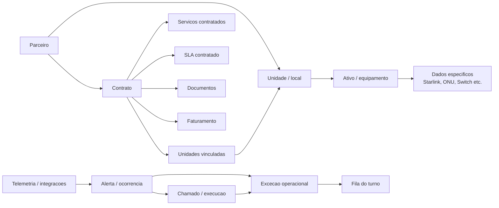

# Arquitetura de informação NOVA

Este documento consolida um primeiro redesenho da hierarquia de paginas do sistema NOVA. Ele foi montado a partir do inventario das rotas atuais, do schema Prisma, dos controllers da API, dos mockups recebidos e de referencias externas de arquitetura de informação.

## Referencias usadas

- [GOV.UK Service Manual - user needs](https://www.gov.uk/service-manual/user-research/start-by-learning-user-needs): partir das necessidades reais dos usuarios e tarefas, nao de opinioes internas.
- [GOV.UK Content Design - user needs](https://www.gov.uk/guidance/content-design/user-needs): cada pagina/conteudo deve atender uma necessidade valida e baseada em acao.
- [Nielsen Norman Group - UX research methods](https://media.nngroup.com/media/articles/attachments/User_Research_Methods_Infographic-sg-kg-sg-kg-compressed.pdf): card sorting ajuda a descobrir agrupamentos mentais; tree testing valida se a hierarquia proposta permite encontrar itens.
- [Home Office Design Manual - navigation](https://design.homeoffice.gov.uk/accessibility/page-structure/navigation): navegacao precisa ser consistente, com wording estavel, breadcrumbs e mais de um caminho quando necessario.
- [Atlassian - new navigation](https://www.atlassian.com/blog/design/designing-atlassians-new-navigation): navegacao de produto precisa evoluir com feedback, revelar complexidade progressivamente e escalar para usuarios novos e avancados.

## Diagnostico atual

### Hierarquia de negocio correta

O dominio principal do produto e:

```text
Parceiro
  -> Unidade / local
      -> Ativo / equipamento
```

Contratos nao deveriam ser uma variante de unidade. O correto e:

```text
Parceiro
  -> Contrato
      -> Unidades cobertas pelo contrato
      -> Servicos, SLA, documentos, faturamento e contatos
```

Hoje `/contratos` ainda infere contrato por campos de `Unit`:

```text
Unit.reportContractLabel
Unit.reportAddressLine
Unit.reportContractedBandwidth
```

Isso explica a sensacao de que a tela mistura conceitos.

### Duplicidades e aliases encontrados

| Area | Rotas atuais | Problema |
| --- | --- | --- |
| Ativos | `/ativos`, `/equipamentos` | Usuario ve "Ativos", mas codigo e algumas rotas antigas usam "Equipamentos". |
| Alertas | `/alertas`, `/ocorrencias` | "Alerta" e o nome de produto; `Occurrence` e o nome tecnico do backend. |
| Chamados | `/chamados`, `/manutencoes` | "Chamado" e fluxo de trabalho; `Maintenance` e entidade tecnica. |
| Excecoes | `/excecoes`, `/operacao/excecoes` | Mesma entidade aparece como area propria e subarea operacional. |
| Automacao | `/automacao`, `/operacao/automacoes` | Mesmo modulo em dois lugares. |
| Importacao | `/importacao`, `/operacao/importacao` | Importacao e administrativa, mas existe caminho operacional. |
| Reconciliacao | `/reconciliacao`, `/reconciliacao-central` | Alias necessario, mas nao deveria aparecer como conceito duplicado. |
| Monitoramento | `/monitoramento`, `/sensores`, `/mapas`, `/alertas`, `/relatorios/monitoramento` | Mistura leitura em tempo real, eventos e relatorio exportavel. |
| Shell/Menu | `AppShell` e `NovaLitShell` | Dois mapas de navegacao coexistem, criando risco de inconsistencia. |

## Regra de organizacao proposta

Separar paginas por tipo de uso:

1. **Cockpit**: leitura executiva e entrada para o trabalho.
2. **Operacao**: o que exige acao do turno.
3. **Monitoramento**: leitura tecnica em tempo real ou quase real.
4. **Cadastros operacionais**: entidades permanentes do negocio.
5. **Contratos**: camada comercial/documental que cobre unidades.
6. **Relatorios**: extracao, historico e documentos gerados.
7. **Administracao**: acesso, integracoes, importacao, reconciliacao e sistema.

## Fluxograma proposto

```mermaid
flowchart TD
  A["/dashboard<br/>Cockpit geral"] --> B["Operacao"]
  A --> C["Monitoramento"]
  A --> D["Cadastros operacionais"]
  A --> E["Contratos"]
  A --> F["Relatorios"]
  A --> G["Administracao"]

  B --> B1["/operacao<br/>Resumo do turno"]
  B --> B2["/operacao/fila<br/>Fila priorizada"]
  B --> B3["/alertas<br/>Alertas e ocorrencias"]
  B --> B4["/chamados<br/>Chamados e execucao"]
  B --> B5["/excecoes<br/>Excecoes, SLA e triagem"]
  B --> B6["/operacao/atividade<br/>Linha do tempo e handoff"]

  C --> C1["/monitoramento<br/>Saude da rede"]
  C --> C2["/monitoramento/sensores<br/>Sensores e hosts"]
  C --> C3["/monitoramento/mapas<br/>Mapa operacional"]
  C --> C4["/monitoramento/fontes<br/>Zabbix, PRTG e telemetria"]

  D --> D1["/parceiros<br/>Parceiros"]
  D --> D2["/unidades<br/>Unidades / locais"]
  D --> D3["/ativos<br/>Ativos / equipamentos"]
  D3 --> D31["/ativos?type=starlink"]
  D3 --> D32["/ativos?type=onu"]
  D3 --> D33["/ativos?type=switch"]
  D3 --> D34["/ativos?type=outros"]

  E --> E1["/contratos<br/>Carteira de contratos"]
  E1 --> E2["/contratos/[id]<br/>Detalhe do contrato"]
  E2 --> E3["Unidades cobertas"]
  E2 --> E4["Documentos"]
  E2 --> E5["SLA, servicos e faturamento"]

  F --> F1["/relatorios<br/>Central de relatorios"]
  F --> F2["/relatorios/monitoramento"]
  F --> F3["/relatorios/consumo"]
  F --> F4["/relatorios/disponibilidade"]
  F --> F5["/relatorios/performance"]
  F --> F6["/relatorios/exportacoes<br/>Historico de exportacao"]

  G --> G1["/usuarios"]
  G --> G2["/perfis"]
  G --> G3["/integracoes"]
  G --> G4["/administracao/importacao"]
  G --> G5["/administracao/reconciliacao"]
  G --> G6["/administracao/automacoes"]
  G --> G7["/administracao/sla"]
  G --> G8["/configuracoes"]
```



## Modelo mental das entidades



## Menu recomendado

### 1. Geral

- Visao geral: `/dashboard`

### 2. Operacao

- Resumo do turno: `/operacao`
- Fila: `/operacao/fila`
- Alertas: `/alertas`
- Chamados: `/chamados`
- Excecoes: `/excecoes`
- Atividade: `/operacao/atividade`

### 3. Monitoramento

- Saude da rede: `/monitoramento`
- Sensores: `/monitoramento/sensores`
- Mapas: `/monitoramento/mapas`
- Fontes de dados: `/monitoramento/fontes`

### 4. Cadastros

- Parceiros: `/parceiros`
- Unidades: `/unidades`
- Ativos: `/ativos`

### 5. Contratos

- Contratos: `/contratos`
- Documentos contratuais: dentro do detalhe do contrato, nao como pagina solta inicialmente.

### 6. Relatorios

- Central: `/relatorios`
- Monitoramento: `/relatorios/monitoramento`
- Consumo: `/relatorios/consumo`
- Disponibilidade: `/relatorios/disponibilidade`
- Performance: `/relatorios/performance`

### 7. Administracao

- Usuarios: `/usuarios`
- Perfis: `/perfis`
- Integracoes: `/integracoes`
- Importacao: `/administracao/importacao`
- Reconciliacao: `/administracao/reconciliacao`
- Automacoes: `/administracao/automacoes`
- Politicas SLA: `/administracao/sla`
- Sistema: `/configuracoes`

## URLs canonicas e compatibilidade

| Conceito | Canonico proposto | Compatibilidade |
| --- | --- | --- |
| Ativos | `/ativos` | `/equipamentos` redireciona para `/ativos` |
| Detalhe de ativo | `/ativos/[id]` | mover codigo de `/equipamentos/[id]` para `/ativos/[id]` gradualmente |
| Alertas | `/alertas` | `/ocorrencias` redireciona |
| Chamados | `/chamados` | `/manutencoes` redireciona |
| Excecoes | `/excecoes` | `/operacao/excecoes` redireciona |
| Automacoes | `/administracao/automacoes` | `/automacao` e `/operacao/automacoes` redirecionam |
| Importacao | `/administracao/importacao` | `/importacao` redireciona |
| Reconciliacao | `/administracao/reconciliacao` | `/reconciliacao` redireciona |
| SLA | `/administracao/sla` ou `/operacao/sla` | escolher conforme dono: admin configura, operacao consulta |

## Ajustes de produto por area

### Contratos

Criar entidade real de contrato antes de ampliar muito a tela:

```text
Contract
ContractUnit
ContractService
ContractBilling
ContractContact
DocumentAttachment(entityType="contract")
```

Enquanto isso nao existir, `/contratos` deve se declarar como "dados contratuais por unidade" ou "carteira contratual inferida", para nao passar a impressao de cadastro definitivo.

### Monitoramento vs alertas

- Monitoramento mostra estado, telemetria, sensores, mapas e fontes.
- Alertas ficam em Operacao porque pedem acao.
- Relatorio de monitoramento fica em Relatorios porque gera documento/exportacao.

### Chamados vs manutencoes

O usuario deve ver "Chamados". O backend pode continuar usando `Maintenance`, mas o front e a navegacao precisam usar uma linguagem so.

### Excecoes vs fila

Excecao e entidade; fila e modo de trabalho. A excecao deve aparecer em `/excecoes`; a fila mostra excecoes, alertas e chamados priorizados para o turno.

### Importacao e reconciliacao

Sao operacoes administrativas de governanca de dados. Devem sair do menu de Operacao para Administracao.

## Plano de execucao recomendado

1. Congelar um unico mapa de navegacao em `NovaLitShell`.
2. Remover `AppShell` antigo das paginas restantes ou transforma-lo em wrapper compativel.
3. Definir tabela de URLs canonicas e manter aliases apenas como redirects.
4. Ajustar labels do menu antes de grandes refactors visuais.
5. Criar breadcrumbs padronizados por hierarquia: `Area / Lista / Detalhe`.
6. Transformar paginas duplicadas em abas ou filtros, nao entradas soltas do menu.
7. Implementar contratos reais no backend antes de continuar expandindo `/contratos`.
8. Testar a hierarquia com tarefas simples:
   - "Encontrar a unidade de um parceiro."
   - "Abrir os ativos de uma unidade."
   - "Criar chamado a partir de um alerta."
   - "Ver contratos de um parceiro."
   - "Gerar relatorio de disponibilidade."
   - "Importar dados legados."

## Criterios para decidir onde uma pagina fica

- Se e dado permanente do negocio, fica em Cadastros.
- Se exige acao do turno, fica em Operacao.
- Se e leitura tecnica de estado, fica em Monitoramento.
- Se gera documento ou analise historica, fica em Relatorios.
- Se configura o sistema, usuarios, integracoes ou dados, fica em Administracao.
- Se cobre condicoes comerciais de atendimento, fica em Contratos.

## Proxima rodada sugerida

Comecar pela navegacao, sem mexer no banco ainda:

1. Atualizar `MENU_SECTIONS` do `NovaLitShell` para o mapa proposto.
2. Manter redirects de compatibilidade.
3. Ajustar breadcrumbs das paginas principais.
4. Corrigir `/relatorios` para ficar ativo em `/relatorios`, nao em `/relatorios/consumo`.
5. Renomear visualmente `/contratos` para deixar claro que ainda e inferido por unidade ate existir `Contract`.

Depois disso, atacar o backend de contratos reais.
